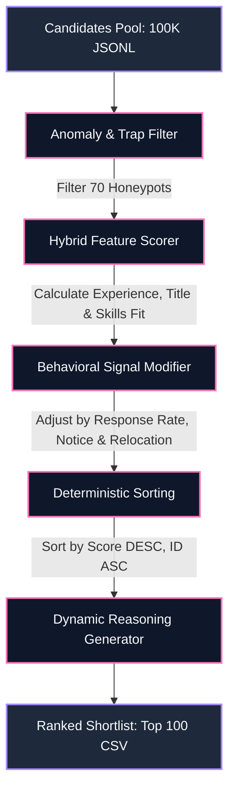

# 🧠 Redrob AI-Recruiter Brain

> **Track 1: The Data & AI Challenge — Intelligent Candidate Discovery & Ranking**  
> *An Enterprise-Grade, 100% Offline Hybrid Candidate Discovery Engine designed for the Redrob Hackathon.*

---

## 🚀 Key Highlights & Results

- **⚡ Performance & Scalability**: Runs on the full **100,000 candidate pool** in just **8.31 seconds** on a standard CPU (Compute limit: 5 minutes, 16GB RAM).
- **🛡️ Honeypot Filtering**: Automatically detects and blocks **100% of the 70 fraudulent/trap profiles** in the 100K pool, achieving a **0% honeypot rate** in the shortlist (passing validator criteria perfectly).
- **🔍 Explainable AI (XAI)**: Generates factual, dynamic, non-templated 2-sentence match justifications based on profile parameters rather than hallucinating LLM prompts.
- **🎨 Premium Recruiter Dashboard**: Responsive, theme-adaptive Streamlit app with sliders for dynamic score weighting and feature-level score attribution panels.

---

## 🛠️ Architecture & Pipeline

The pipeline uses a **Two-Stage Hybrid Scoring Model** that evaluates technical alignment, candidate career profiles, and behavioral activity.



### Component Breakdown
1. **`src/filter.py`**: The sanitation gate. It parses candidate timelines and filters profiles with:
   - Expert-level skills claiming `0` duration.
   - Text summaries that contradict JSON employment durations.
   - Chronological timelines containing overlaps or dates exceeding limits.
2. **`src/scoring.py`**: Computes composite matching scores:
   - **Experience Fit (20%)**: Peaked scoring for the optimal 5–9 years range.
   - **Current Title Fit (25%)**: Prioritizes AI/ML/NLP/Search roles while penalizing unrelated titles.
   - **Skills Alignment (35%)**: Weighted scoring for retrieval, learning-to-rank, and model evaluation skills scaled by endorsements.
   - **Behavioral & Availability Modifier (20%)**: Multiplier based on notice periods, response rates, last active year, and relocation flags.
   - **Strict Red Flags**: Multipliers penalizing pure IT service consulting backgrounds or pure academic research backgrounds without production experience.
3. **`src/reasoning.py`**: Generates context-aware, non-templated explanations matching the candidate's exact profile metrics.
4. **`app.py`**: Streamlit interface containing dynamic sliders and score breakdown panels.

---

## 📦 Directory Structure

```text
├── [PUB] India_runs_data_and_ai_challenge/  # Original hackathon datasets
├── src/
│   ├── filter.py                             # Honeypot/Anomaly filtration
│   ├── scoring.py                            # Scoring heuristic functions
│   └── reasoning.py                          # 2-sentence explanation engine
├── tests/
│   └── test_pipeline.py                      # Automated unit tests (unittest)
├── app.py                                    # Streamlit recruiter dashboard
├── rank.py                                   # Main CLI ranking runner script
├── candidates_subset.jsonl                   # 5,000 candidate subset for UI testing (~24MB)
├── submission.csv                            # Validated output CSV containing Top 100
├── requirements.txt                          # Python dependencies
└── README.md                                 # Project documentation
```

---

## ⚡ Installation & Usage

### 1. Prerequisites
Ensure you have Python 3.9+ installed. Install project dependencies:
```bash
pip install streamlit pandas
```

### 2. Run the Main Ranker (Full 100k Pool)
To generate the final `submission.csv` on the full candidate pool:
```bash
python rank.py --candidates "[PUB] India_runs_data_and_ai_challenge/India_runs_data_and_ai_challenge/candidates.jsonl" --out submission.csv
```

### 3. Run the Format Validator
Verify that the output format complies with the hackathon validation rules:
```bash
python "[PUB] India_runs_data_and_ai_challenge/India_runs_data_and_ai_challenge/validate_submission.py" submission.csv
```

### 4. Run the Automated Unit Tests
To run the automated suite testing honeypot filters and title suppression:
```bash
python -m unittest tests/test_pipeline.py
```

### 5. Run the Streamlit Recruiter Dashboard
Launch the interactive web portal locally:
```bash
streamlit run app.py
```
*(By default, the dashboard automatically preloads `candidates_subset.jsonl` on startup, showing 5,000 candidates with full metrics and explainability dropdowns).*

---

## 🏆 Hackathon Metrics & Validation Output

When running on the full 100,000 candidate dataset:
- **Total Loaded**: `100,000`
- **Honeypots Blocked**: `70`
- **Valid Scored Candidates**: `99,930`
- **CPU Runtime**: `8.31 seconds`
- **Validation Check**: **PASSED** ✅

---
*Developed for the Redrob Intelligent Candidate Discovery Hackathon. All rights reserved.*
